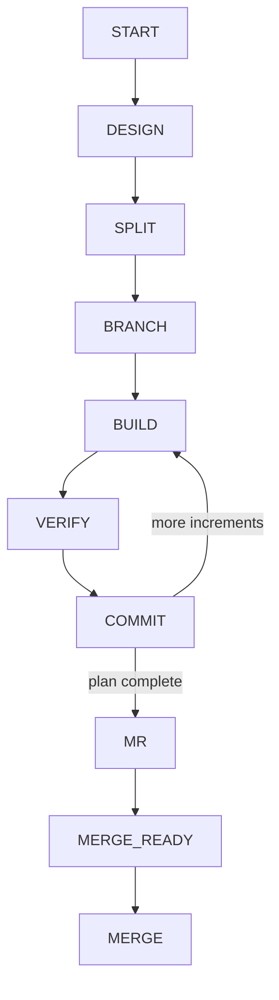
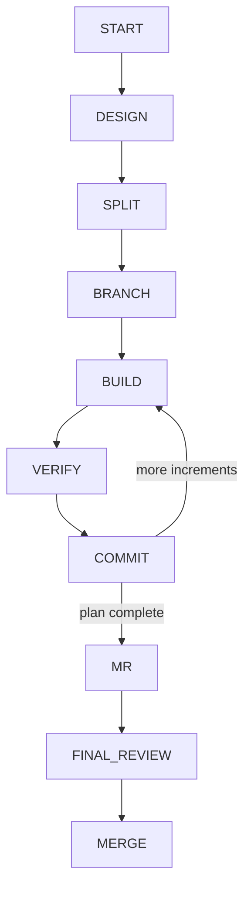
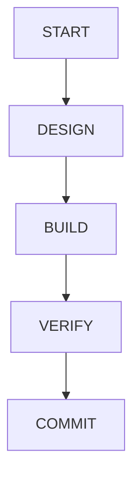

# agents

An executable AI development workflow focused on reliable engineering rather
than conversational memory.

`AGENTS.md` defines policy. `skills/workflow/scripts/workflow.ps1` enforces phase
transitions and stores committable state in `.progress/workflow.json`, allowing a
workflow to resume on another machine. Finished workflows remove that state.

## Detailed

For multi-increment, architectural, or public-interface work. The user shapes
the design, approves each increment, reviews the branch, and explicitly approves
the merge.

## Detailed Auto

Runs the same phases, reviews, tests, commits, and merge preparation as Detailed.
The agent handles intermediate decisions; the user is involved once at the final
review, whose approval authorizes merge.

## Quick

For one small, self-contained change with a handful of clear design choices. It
uses one build/verify/commit pass on the current branch.

Future Detailed increments can be inserted or reordered without changing active
or completed increment identity. The controller validates approvals, branches,
commits, and legal transitions before saving state atomically.

## Repository layout

- `AGENTS.md` — concise policy and entry point
- `agents/` — phase role definitions
- `code-review/` — ignored local review JSON and generated Markdown
- `skills/workflow/` — executable workflow state machine
- `skills/install-powershell/` — PowerShell 7 bootstrap instructions
- `skills/` — review, design, ADR, debug, merge, and retrospective actions
