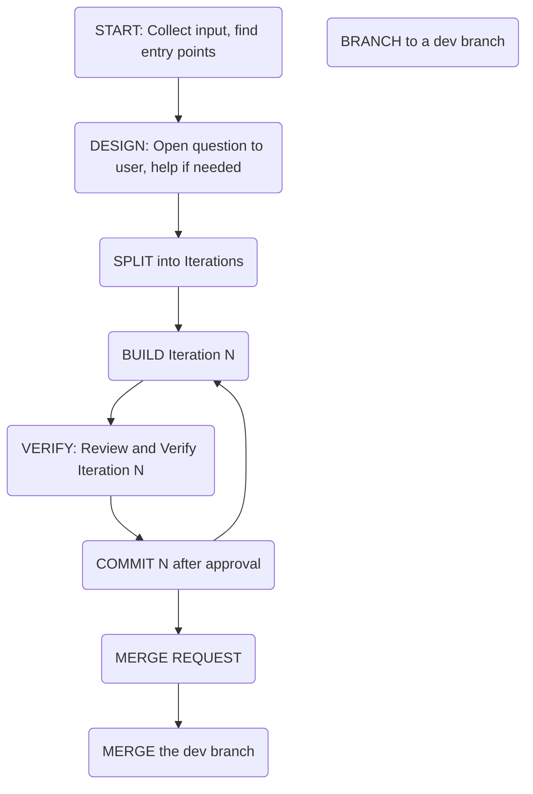
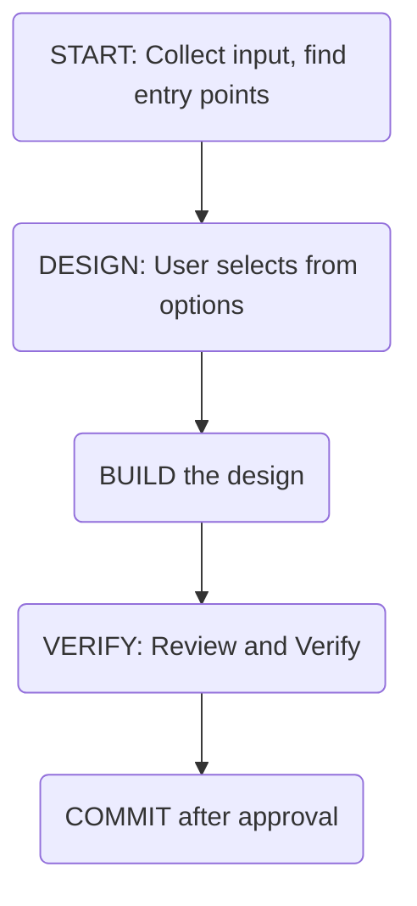

# agents
AI workflow allowing to develop and understand, not just vibe-code

Detailed flow

```mermaid
flowchart TD

START("START: Collect input, find entry points")
DESIGN("DESIGN: Open question to user, help if needed")
SPLIT("SPLIT into Iterations")
BRANCH("BRANCH to a dev branch")
BUILD("BUILD Iteration N")
VERIFY("VERIFY: Review and Verify Iteration N")
COMMIT("COMMIT N after approval")
MR("MERGE REQUEST")
MERGE("MERGE the dev branch")


START --> DESIGN
DESIGN --> SPLIT
SPLIT -->BUILD
BUILD --> VERIFY
VERIFY --> COMMIT
COMMIT --> BUILD
COMMIT --> MR
MR --> MERGE
```

Vibe Flow:

```mermaid
flowchart TD

START("START: Collect input, find entry points")
DESIGN("DESIGN: User selects from options")
BUILD("BUILD the design")
VERIFY("VERIFY: Review and Verify")
COMMIT("COMMIT after approval")

START --> DESIGN
DESIGN --> BUILD
BUILD --> VERIFY
VERIFY --> COMMIT

```
