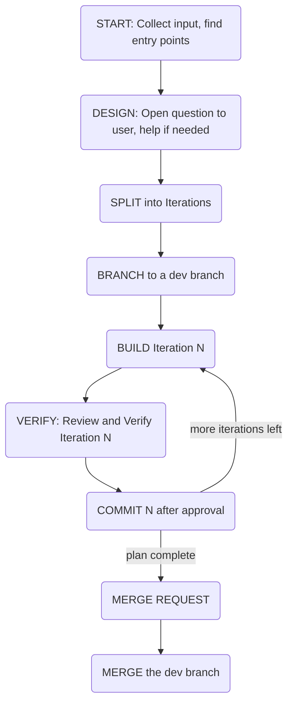
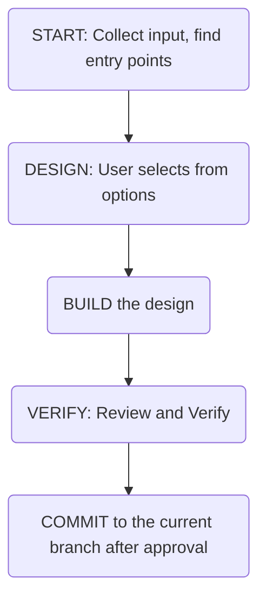

# agents

AI workflow allowing to develop and understand, not just vibe-code.

`AGENTS.md` is the executable spec agents follow; the diagrams below are the
summary for humans. At the start of any task that changes files, the agent
proposes one of the two flows and the user confirms.

## Detailed flow

For work that spans multiple increments, needs real design decisions, or touches
public interfaces. Every increment is built, verified, and committed on a feature
branch; the branch is merged only after an MR description is approved.

## Vibe flow

For small, self-contained changes where the design is a pick between a few clear
options. Single pass, no increment plan, and — as the one sanctioned exception to
the branch rule — the approved result is committed to the currently checked-out
branch, even if that is the default branch.

Both flows keep the same quality bar: explanation before code, inline docs written
at implementation time, and an ADR for every genuinely architectural decision.
The increment size cap and MR/MERGE ceremony apply to the Detailed flow only.

## Repo layout

- `AGENTS.md` — base operating instructions for agents
- `agents/` — role definitions adopted per phase (`architect`, `developer`, `tester`, `reviewer`)
- `skills/` — reusable agent actions (`adr`, `adversarial-ut`, `code-review`, `debug`, `design`, `merge`, `retro`)
