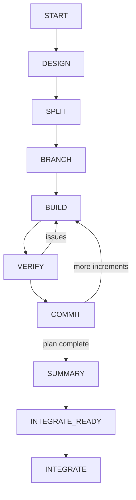
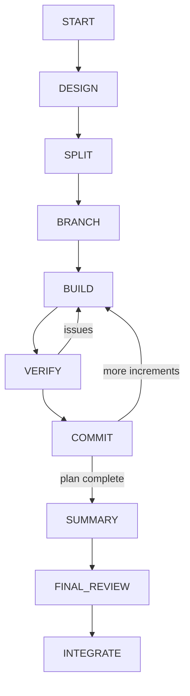
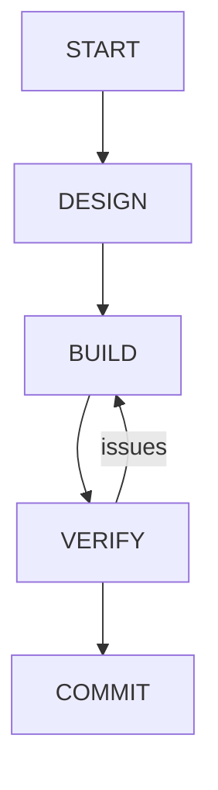

# agents

An executable AI development workflow focused on reliable engineering rather than conversational memory.

`AGENTS.md` defines policy. `skills/dev-workflow/scripts/workflow.ps1` enforces phase transitions and stores committable state in `.progress/workflow.json`, allowing a workflow to resume on another machine. Before integration, `dev-workflow-clean-branch` removes that state from every feature-branch commit.

## Detailed

For multi-increment, architectural, or public-interface work. The user shapes the design, approves each increment, reviews the branch, and explicitly approves integration.

```mermaid
flowchart TD
START --> DESIGN --> SPLIT --> BRANCH --> BUILD --> VERIFY --> COMMIT
VERIFY -->|issues| BUILD
COMMIT -->|more increments| BUILD
COMMIT -->|plan complete| SUMMARY --> INTEGRATE_READY --> INTEGRATE
```

## Detailed Auto

Runs the same phases, reviews, tests, commits, and integration preparation as Detailed. The agent handles intermediate decisions; the user is involved once at the final summary, whose approval authorizes integration.

```mermaid
flowchart TD
START --> DESIGN --> SPLIT --> BRANCH --> BUILD --> VERIFY --> COMMIT
VERIFY -->|issues| BUILD
COMMIT -->|more increments| BUILD
COMMIT -->|plan complete| SUMMARY --> FINAL_REVIEW --> INTEGRATE
```

## Quick

For one small, self-contained change with a handful of clear design choices. It uses one build/verify/commit pass on the current branch.

```mermaid
flowchart TD
START --> DESIGN --> BUILD --> VERIFY --> COMMIT
VERIFY -->|issues| BUILD
```

## Integration

`INTEGRATE` always rebases, so the default branch never gains a merge commit. The user then chooses how the branch lands, and the skill asks every time:

| Mode | Result |
| --- | --- |
| Commits | every commit is kept and the base fast-forwards |
| Squash | the branch becomes one commit and the base fast-forwards |
| Request | the branch becomes one commit, is pushed, and a pull request is opened |

Future Detailed increments can be inserted or reordered without changing active or completed increment identity. The controller validates approvals, branches, commits, and legal transitions before saving state atomically. Every controller change prints user-presentable Markdown tables for the workflow phases and increment statuses.

## Repository layout

- `AGENTS.md` — concise policy and entry point
- `agents/` — phase role definitions
- `code-review/` — ignored local review JSON and generated Markdown
- `skills/dev-workflow/` — executable workflow state machine
- `skills/install-powershell/` — PowerShell 7 bootstrap instructions
- `skills/agents-install/` — global installation for local AI tools
- `skills/git-commit/` — the commit message format and its checker. Commits are attributed to the person who records them; the checker rejects AI co-author and generator trailers
- `skills/` — review, design, ADR, debug, summary, progress cleanup, commit, integration, and retrospective actions
