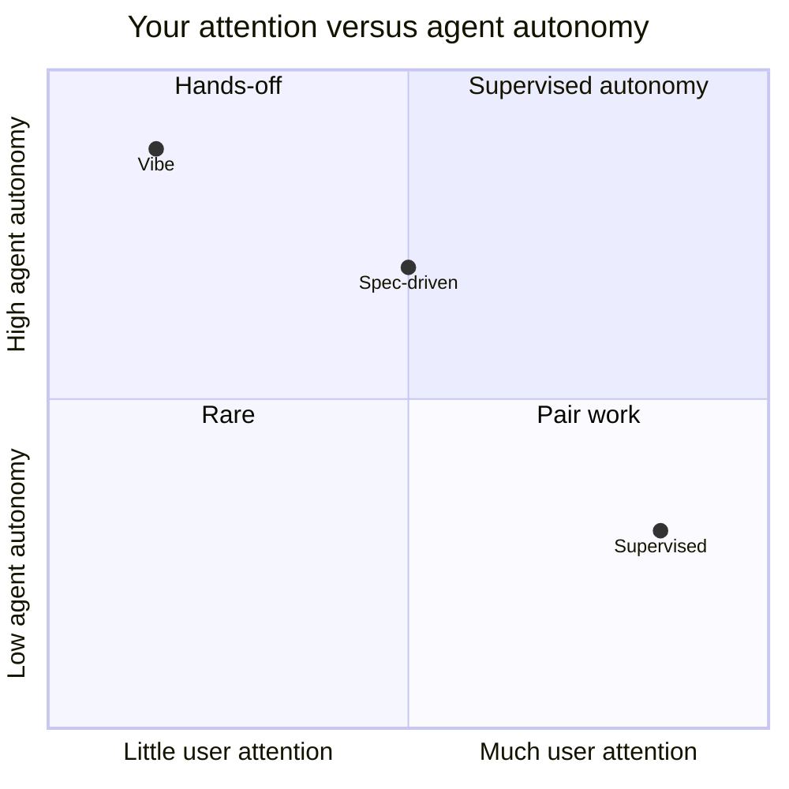
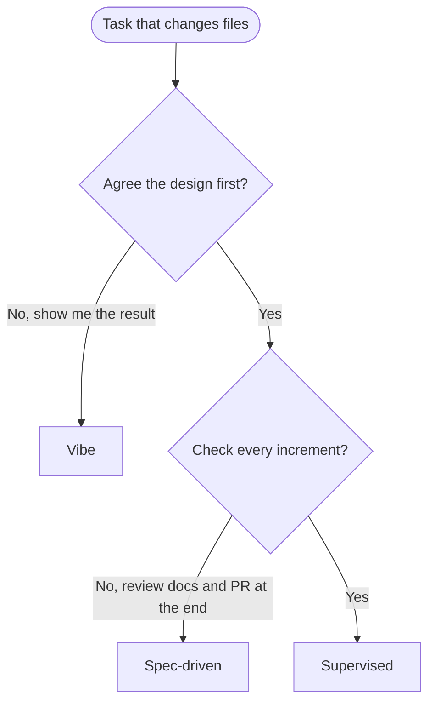
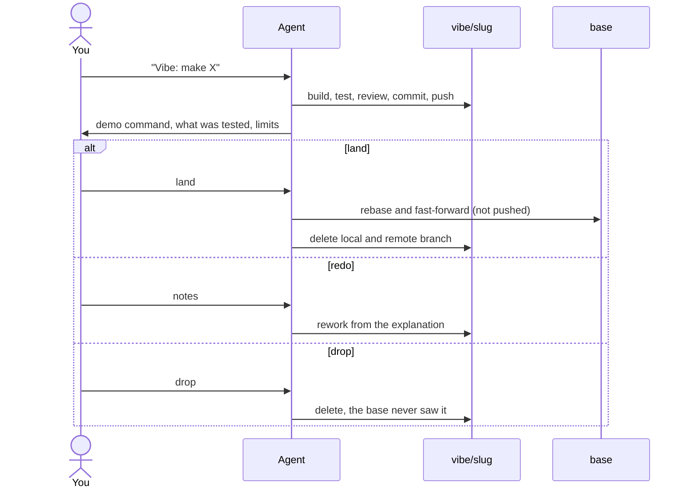
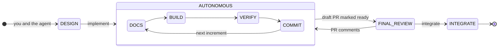
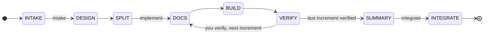

<div align="center">

# 🤖 agents

[](https://github.com/an-dr/agents/actions/workflows/checks.yml) [](LICENSE) [](https://ai-level.dev/level-3) [](https://agentskills.io/specification)

**Transparent AI development: you choose how much of your attention each change gets.**

</div>

Agent instructions, reusable skills, and a deterministic workflow controller that expose the agent's decisions, so you can understand and steer the development instead of reviewing a finished diff you never saw coming.

---

<div align="center">

Supported platforms:

[](#-installation) [](#-installation) [](#-installation) [](#-installation) [](#-installation) [](#-installation)

</div>

## 🎯 Why

Unseen decisions are the risk in AI development. This repository lets you choose, per task, where your attention goes: the result, the design and its documentation, or every step. Whatever you choose, the agent records requests, questions, and design choices, and it stops at gates where only your explicit approval moves the work forward. Those decisions and approvals need to survive beyond a chat session, so this repository supplies shared engineering policy and skills, with an executable controller for gated work, saved state in `.progress/workflow.json`, and a live progress page, `tmp-agent-progress.html`, at the host root.

## 📑 Contents

- [🤖 agents](#-agents)
    - [🎯 Why](#-why)
    - [📑 Contents](#-contents)
    - [📦 Installation](#-installation)
    - [🚀 Quickstart](#-quickstart)
    - [🧭 Choosing a flow](#-choosing-a-flow)
    - [✨ Features](#-features)
    - [🔧 Configuration](#-configuration)
    - [📚 Documentation](#-documentation)
        - [📁 Repository layout](#-repository-layout)
        - [🔗 Skill dependencies](#-skill-dependencies)
    - [🧰 Development](#-development)
    - [🔍 AI disclosure](#-ai-disclosure)
    - [🤝 Contributing](#-contributing)
    - [📄 License](#-license)
    - [📈 Status](#-status)

## 📦 Installation

Install Git and PowerShell 7 first. The [PowerShell setup skill](skills/actions/an-dr-env-install-powershell/SKILL.md) covers a missing or outdated `pwsh` runtime.

```powershell
git clone https://github.com/an-dr/agents.git
Set-Location agents
pwsh skills/_repository/an-dr-agents-repo-install/scripts/install-agents.ps1
pwsh skills/_repository/an-dr-agents-repo-install/scripts/verify-agents.ps1
```

The installer adds a managed policy reference and links the skills into supported tools' user configuration. It handles Claude Code, Codex, GitHub Copilot CLI, DeepSeek Harness, Gemini CLI, and opencode; its current skill-link support covers the first four, while Gemini CLI and opencode receive policy references. See the [installation skill](skills/_repository/an-dr-agents-repo-install/SKILL.md) for tool selection, updates, conflicts, and removal.

## 🚀 Quickstart

Open the project you want to change in your AI tool and select a flow in the request:

```text
Vibe: fix the parser's handling of empty input. Preserve its public API.
```

| Flow        | Your attention goes to    | You decide                                                  | Where it lands                                                |
| ----------- | ------------------------- | ----------------------------------------------------------- | ------------------------------------------------------------- |
| Vibe        | The result                | land, redo, or drop after trying it                         | `vibe/<slug>` branch, fast-forwarded into the base on land    |
| Spec-driven | The design, then the docs | implement after the design talk, integrate after the review | `spec/<slug>` branch and pull request, or the base on request |
| Supervised  | Every step                | intake, implement, each increment's verification, integrate | `supervised/<slug>` branch and pull request                   |

Work branches are pushed to the remote automatically; the base branch never is. For gated work, the [workflow controller skill](skills/actions/an-dr-dev-follow-workflow/README.md) owns the commands and transitions. The agent resumes existing state instead of reconstructing it from conversation history. [AGENTS.md](AGENTS.md) defines the policy, including the separate review rule for changes to this process repository.

## 🧭 Choosing a flow

The three flows sit on one line: how much of your attention a change takes, and how much the agent does alone in exchange. You always name the flow yourself; the agent never infers it from task size.


```mermaid
quadrantChart
  title Your attention versus agent autonomy
  x-axis Little user attention --> Much user attention
  y-axis Low agent autonomy --> High agent autonomy
  quadrant-1 Supervised autonomy
  quadrant-2 Hands-off
  quadrant-3 Rare
  quadrant-4 Pair work
  Vibe: [0.15, 0.88]
  Spec-driven: [0.5, 0.7]
  Supervised: [0.85, 0.3]
```


```mermaid
flowchart TD
  S([Task that changes files]) --> A{Agree the design first?}
  A -- No, show me the result --> V[Vibe]
  A -- Yes --> C{Check every increment?}
  C -- No, review docs and PR at the end --> SD[Spec-driven]
  C -- Yes --> SU[Supervised]
```

**Vibe** — you judge the behaviour, not the code. The agent builds, tests, and reviews on a `vibe/<slug>` branch, then hands over one command, artefact, or screenshot that shows the change, what was tested, and its limits. You answer with one word.


```mermaid
sequenceDiagram
  actor U as You
  participant A as Agent
  participant B as vibe/slug
  participant M as base
  U->>A: "Vibe: make X"
  A->>B: build, test, review, commit, push
  A->>U: demo command, what was tested, limits
  alt land
    U->>A: land
    A->>M: rebase and fast-forward (not pushed)
    A->>B: delete local and remote branch
  else redo
    U->>A: notes
    A->>B: rework from the explanation
  else drop
    U->>A: drop
    A->>B: delete, the base never saw it
  end
```

**Spec-driven** — you shape the design; the agent does the rest. The documentation is the review surface: you check that the docs say what you agreed and that the behaviour matches the docs, with the change report and the pull request beside them.


```mermaid
stateDiagram-v2
  direction LR
  [*] --> DESIGN: you and the agent
  DESIGN --> AUTONOMOUS: implement
  state AUTONOMOUS {
    direction LR
    DOCS --> BUILD
    BUILD --> VERIFY
    VERIFY --> COMMIT
    COMMIT --> DOCS: next increment
  }
  AUTONOMOUS --> FINAL_REVIEW: draft PR marked ready
  FINAL_REVIEW --> AUTONOMOUS: PR comments
  FINAL_REVIEW --> INTEGRATE: integrate
  INTEGRATE --> [*]
```

**Supervised** — every increment waits for your verification before the next begins. Use it for architecture-heavy or risky work, where catching a wrong turn early is worth your time.


```mermaid
stateDiagram-v2
  direction LR
  [*] --> INTAKE
  INTAKE --> DESIGN: intake
  DESIGN --> SPLIT
  SPLIT --> DOCS: implement
  DOCS --> BUILD
  BUILD --> VERIFY
  VERIFY --> DOCS: you verify, next increment
  VERIFY --> SUMMARY: last increment verified
  SUMMARY --> INTEGRATE: integrate
  INTEGRATE --> [*]
```

Spec-driven and Supervised integrate through their pull or merge request, using the repository's own merge method; without a supported platform the agent says what is missing and integrates locally.

## ✨ Features

- Shared engineering instructions available across projects through one global installation.
- Three flows by attention — Vibe, Spec-driven, Supervised — with explicit gates, resumable state, and a live progress page.
- Self-contained skills for specification, implementation, debugging, testing, review, documentation, and Git operations.
- HTML reports for code reviews, project overviews, and completed changes.
- Deterministic script checks and separate, explicitly requested agent evaluations.
- Integration through pull or merge requests with the repository's merge method, a local fallback that rebases before landing, and no workflow state in delivered history.

## 🔧 Configuration

A global installation engages the workflow policy when the host project's root `AGENTS.md` or `CLAUDE.md` references this clone, an active `.progress/workflow.json` exists, or the user names a flow or one of its skills. Otherwise the skills remain available on request. Add a reference to the clone's [AGENTS.md](AGENTS.md) in the host's instruction file when the project should opt in permanently.

The installer's `-Tools` parameter limits which tools are configured. Re-run the installer after adding skills or moving the clone. [Installation verification](skills/_repository/an-dr-agents-repo-verify-installation/SKILL.md) distinguishes broken links, missing project opt-in, and a running tool failing to load the policy.

Generated skill outputs live under `.tmp-ai-gen/` according to the [artifact layout convention](skills/conventions/an-dr-convention-artifact-layout/SKILL.md). HTML diagram rendering requires a local Chromium-based browser; the [HTML report convention](skills/conventions/an-dr-convention-html-report/SKILL.md) describes rendering and visual verification.

## 📚 Documentation

- [Engineering policy](AGENTS.md): workflow selection, approvals, delivery, and Git rules.
- [Skill catalog](skills/README.md): actions, concepts, conventions, and repository maintenance skills.
- [Testing guide](tests/README.md): local checks, evaluation requests, fixtures, and coverage limits.
- [Skill testing convention](skills/conventions/an-dr-convention-agent-skill-testing/SKILL.md): the evaluation contract and execution environment.

### 📁 Repository layout

| Path                  | Purpose                                                              |
| --------------------- | -------------------------------------------------------------------- |
| `AGENTS.md`           | Policy entry point                                                   |
| `skills/actions/`     | Procedures the agent performs                                        |
| `skills/concepts/`    | Principles applied when their subject is in play                     |
| `skills/conventions/` | Artifact formats and their mechanical checks                         |
| `skills/_repository/` | Maintenance and installation of this repository                      |
| `tests/run-all.ps1`   | Discovery of conventional skill test runners                         |
| `.tmp-ai-gen/`        | Ignored generated skill outputs, with a `<kind>-latest` copy of each |

### 🔗 Skill dependencies

Skills declare the other skills they name through `metadata.an-dr.dependencies`. The [skill convention](skills/conventions/an-dr-convention-agent-skill/SKILL.md) defines this contract and the portability rules: each skill owns its files, and callers pass the location of another skill's public script rather than assuming an installation layout.

The [dependency builder](skills/_repository/an-dr-agents-repo-build-dependencies/SKILL.md) derives the graph below from those declarations. Arrows point from a skill to its declared dependencies. Isolated skills are omitted; the graph describes instruction dependencies, rather than every runtime script call.

<details><summary>Show the generated dependency graph</summary>

<!-- skill-dependencies begin -->


```mermaid
flowchart LR
    subgraph g_repository["Repository"]
        an-dr-agents-analyze-session
        an-dr-agents-repo-build-dependencies
        an-dr-agents-repo-convention-skills
        an-dr-agents-repo-install
        an-dr-agents-repo-modify
        an-dr-agents-repo-verify-installation
    end
    subgraph g_actions["Actions"]
        an-dr-ai-collect-input
        an-dr-ai-review-instruction
        an-dr-ai-send-message
        an-dr-ai-skill-implement-test
        an-dr-ai-skill-test
        an-dr-ai-write-instruction
        an-dr-architecture-fix-dependencies
        an-dr-dev-analyze-changes
        an-dr-dev-analyze-slop
        an-dr-dev-assign-ai-level
        an-dr-dev-debug
        an-dr-dev-design
        an-dr-dev-follow-workflow
        an-dr-dev-implement-adversarial-ut
        an-dr-dev-implement-code
        an-dr-dev-implement-pipeline
        an-dr-dev-integrate
        an-dr-dev-review
        an-dr-dev-test
        an-dr-dev-write-documentation
        an-dr-dev-write-readme
        an-dr-dev-write-specification
        an-dr-env-install-powershell
        an-dr-files-build-report
        an-dr-files-make-screengif
        an-dr-files-make-screenshot
        an-dr-git-modify-history
        an-dr-project-write-overview
        an-dr-text-analyze-slop
        an-dr-text-verify-claims
        an-dr-text-write-curated
    end
    subgraph g_concepts["Concepts"]
        an-dr-concept-ai-slop
        an-dr-concept-clean-dependencies
        an-dr-concept-dark-cockpit
        an-dr-concept-evidence-grounding
        an-dr-concept-single-authority
    end
    subgraph g_conventions["Conventions"]
        an-dr-convention-adr
        an-dr-convention-agent-skill-testing
        an-dr-convention-agent-skill
        an-dr-convention-ai-level
        an-dr-convention-artifact-layout
        an-dr-convention-code
        an-dr-convention-commit-message
        an-dr-convention-html-report
        an-dr-convention-layout
        an-dr-convention-markdown
        an-dr-convention-readme
        an-dr-convention-script
        an-dr-convention-use-case
    end
    an-dr-agents-analyze-session --> an-dr-agents-repo-modify
    an-dr-agents-repo-build-dependencies --> an-dr-ai-send-message & an-dr-convention-agent-skill
    an-dr-agents-repo-convention-skills --> an-dr-ai-skill-implement-test & an-dr-ai-skill-test & an-dr-convention-agent-skill & an-dr-dev-test & an-dr-dev-write-documentation & an-dr-convention-agent-skill-testing
    an-dr-agents-repo-install --> an-dr-ai-skill-test
    an-dr-agents-repo-modify --> an-dr-agents-repo-convention-skills & an-dr-agents-repo-install & an-dr-agents-repo-verify-installation & an-dr-ai-review-instruction & an-dr-ai-send-message & an-dr-ai-skill-implement-test & an-dr-ai-skill-test & an-dr-ai-write-instruction & an-dr-convention-agent-skill & an-dr-convention-markdown & an-dr-convention-script & an-dr-git-modify-history
    an-dr-agents-repo-verify-installation --> an-dr-agents-repo-install & an-dr-ai-skill-implement-test & an-dr-ai-skill-test & an-dr-convention-commit-message
    an-dr-ai-collect-input --> an-dr-ai-send-message & an-dr-concept-ai-slop & an-dr-concept-evidence-grounding
    an-dr-ai-review-instruction --> an-dr-ai-send-message
    an-dr-ai-send-message --> an-dr-concept-dark-cockpit & an-dr-files-build-report
    an-dr-ai-skill-implement-test --> an-dr-ai-write-instruction & an-dr-convention-agent-skill & an-dr-convention-script & an-dr-convention-agent-skill-testing
    an-dr-ai-skill-test --> an-dr-ai-skill-implement-test & an-dr-ai-send-message & an-dr-files-build-report & an-dr-convention-script & an-dr-convention-agent-skill-testing
    an-dr-ai-write-instruction --> an-dr-ai-review-instruction & an-dr-concept-ai-slop & an-dr-convention-markdown & an-dr-dev-write-documentation
    an-dr-architecture-fix-dependencies --> an-dr-ai-send-message & an-dr-concept-clean-dependencies & an-dr-files-build-report & an-dr-convention-html-report
    an-dr-dev-analyze-changes --> an-dr-ai-send-message & an-dr-concept-ai-slop & an-dr-convention-adr & an-dr-files-build-report & an-dr-convention-html-report & an-dr-dev-review & an-dr-dev-write-documentation
    an-dr-dev-analyze-slop --> an-dr-ai-review-instruction & an-dr-ai-send-message & an-dr-concept-ai-slop & an-dr-files-build-report & an-dr-convention-html-report
    an-dr-dev-assign-ai-level --> an-dr-ai-send-message & an-dr-convention-ai-level
    an-dr-dev-design --> an-dr-ai-send-message & an-dr-convention-adr & an-dr-convention-use-case & an-dr-dev-write-documentation
    an-dr-dev-follow-workflow --> an-dr-ai-send-message & an-dr-convention-adr & an-dr-dev-analyze-changes & an-dr-dev-debug & an-dr-dev-design & an-dr-dev-implement-code & an-dr-dev-implement-pipeline & an-dr-dev-integrate & an-dr-dev-review & an-dr-dev-test & an-dr-dev-write-documentation & an-dr-dev-write-readme & an-dr-dev-write-specification & an-dr-git-modify-history
    an-dr-dev-implement-code --> an-dr-convention-adr & an-dr-convention-code & an-dr-convention-layout & an-dr-dev-write-documentation
    an-dr-dev-implement-pipeline --> an-dr-ai-send-message & an-dr-convention-code
    an-dr-dev-integrate --> an-dr-ai-send-message & an-dr-convention-commit-message & an-dr-git-modify-history
    an-dr-dev-review --> an-dr-ai-send-message & an-dr-concept-ai-slop & an-dr-concept-clean-dependencies & an-dr-concept-evidence-grounding & an-dr-convention-artifact-layout & an-dr-convention-code & an-dr-convention-html-report & an-dr-convention-layout
    an-dr-dev-test --> an-dr-ai-send-message & an-dr-dev-implement-adversarial-ut
    an-dr-dev-write-documentation --> an-dr-ai-send-message & an-dr-concept-ai-slop & an-dr-convention-adr & an-dr-convention-markdown & an-dr-convention-use-case
    an-dr-dev-write-readme --> an-dr-ai-send-message & an-dr-dev-assign-ai-level & an-dr-convention-markdown & an-dr-convention-readme & an-dr-dev-write-documentation & an-dr-files-make-screengif & an-dr-files-make-screenshot
    an-dr-dev-write-specification --> an-dr-ai-send-message & an-dr-concept-clean-dependencies & an-dr-convention-adr & an-dr-convention-use-case & an-dr-dev-write-documentation
    an-dr-env-install-powershell --> an-dr-ai-send-message
    an-dr-files-build-report --> an-dr-convention-artifact-layout & an-dr-convention-html-report
    an-dr-files-make-screengif --> an-dr-files-make-screenshot
    an-dr-files-make-screenshot --> an-dr-files-build-report
    an-dr-git-modify-history --> an-dr-convention-commit-message
    an-dr-project-write-overview --> an-dr-concept-ai-slop & an-dr-files-build-report & an-dr-convention-html-report & an-dr-dev-write-documentation
    an-dr-text-analyze-slop --> an-dr-ai-send-message & an-dr-concept-ai-slop & an-dr-files-build-report & an-dr-convention-html-report
    an-dr-text-verify-claims --> an-dr-ai-send-message & an-dr-files-build-report & an-dr-convention-html-report
    an-dr-text-write-curated --> an-dr-ai-send-message & an-dr-text-verify-claims & an-dr-text-analyze-slop & an-dr-convention-artifact-layout
    an-dr-convention-agent-skill --> an-dr-concept-clean-dependencies & an-dr-convention-script & an-dr-convention-agent-skill-testing & an-dr-convention-markdown
    an-dr-convention-code --> an-dr-concept-ai-slop & an-dr-concept-clean-dependencies & an-dr-convention-layout
    an-dr-convention-html-report --> an-dr-concept-dark-cockpit & an-dr-convention-artifact-layout
    an-dr-convention-layout --> an-dr-convention-artifact-layout
    an-dr-convention-readme --> an-dr-concept-ai-slop & an-dr-concept-evidence-grounding & an-dr-convention-markdown
    an-dr-convention-script --> an-dr-ai-send-message & an-dr-convention-agent-skill-testing
```

<!-- skill-dependencies end -->

</details>

## 🧰 Development

Run the repository checks from the clone root:

```powershell
pwsh tests/run-all.ps1
```

The runner discovers skill manifests and invokes each conventional `scripts/tests/run.ps1`, by default only for the suites your uncommitted change affects; `pwsh tests/run-all.ps1 -All` runs every suite, as CI does on each push. Each suite owns its validators and regression tests; the testing convention's suite discovers `evals/evals.json` files and validates their ZIP fixtures. Missing runners and failed suites produce a nonzero exit code. Fixture scripts are excluded from test discovery.

Skills with scripts keep deterministic tests in `scripts/tests/`. Every skill has behavioral cases in `evals/evals.json` and evaluation intent in `evals/EVAL.md`; repository fixtures, when needed, are ZIP archives under `evals/fixtures/`. See the [testing guide](tests/README.md) for commands and run limits. Syntax-only checks establish parsing coverage, and successful structural checks do not establish that an agent follows a skill.

[GitHub Actions](.github/workflows/checks.yml) runs free checks on pushes and pull requests. CI installs the Agent Skills reference validator, `skills-ref`; local checks report its installation command when it is missing. Agent evaluations consume model usage and run only on explicit request, with declared environments and bounded attempts.

## 🔍 AI disclosure

This repository values transparency about how software is made, and it encourages everyone to disclose AI usage in their repositories. Its own level is 3 (`ASSISTED`) on the [ai-level.dev](https://ai-level.dev) scale: AI wrote functional modules, and a human reviews every change before it enters history. The [AI level convention](skills/conventions/an-dr-convention-ai-level/SKILL.md) defines the levels, and the [assign skill](skills/actions/an-dr-dev-assign-ai-level/SKILL.md) assigns one to any repository, offered whenever a README is written.

## 🤝 Contributing

Follow [AGENTS.md](AGENTS.md) for changes to this repository, use the [skill convention](skills/conventions/an-dr-convention-agent-skill/SKILL.md) when changing skills, and run the repository checks before proposing a change. Keep generated artifacts out of commits. This repository keeps no ADRs: state every decision in the skill or policy that owns it, so the skills and [AGENTS.md](AGENTS.md) are the record.

## 📄 License

[MIT](LICENSE), copyright 2026 Andrei Gramakov.

## 📈 Status

Actively maintained, with automated checks on pushes and pull requests. CI checks scripts and packaging; behavioral reliability requires separately executed agent evaluations.
