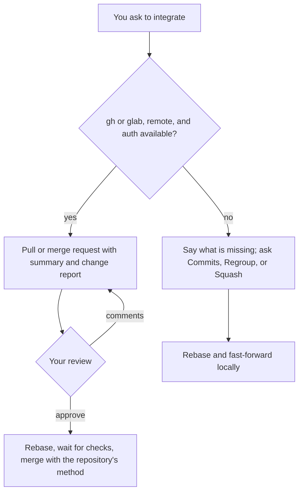

# an-dr-dev-integrate

Lands a branch on its base when you ask for it, normally through its pull or merge request, and locally only when no platform is available. The base is the branch the handed-over state names, so work started on `dev` lands on `dev` from any machine; without it, the default branch.

## When it runs

- When you say to address the request's review comments.
- When you ask to integrate, merge, or land a branch, and only then.

## How it works

```mermaid
flowchart TD
  P[You ask to integrate] --> D{gh or glab, remote, and auth available?}
  D -- yes --> R[Pull or merge request with summary and change report]
  R --> C{Your review}
  C -- comments --> R
  C -- approve --> M[Rebase, wait for checks, merge with the repository's method]
  D -- no --> Q[Say what is missing; ask Commits, Regroup, or Squash]
  Q --> LL[Rebase and fast-forward locally]
```

- **Review in the request.** Your comments sit on the lines they discuss. The agent answers each thread and resolves the ones it fixed. While the request is open it only adds commits, so your threads never go stale.
- **Merge method.** The request merges the way the repository is configured. GitLab applies its project setting. GitHub has no single default, so if several methods are allowed, the agent asks which one.
- **Local fallback.** Without a platform, the agent rebases and asks you each time whether to keep every commit, regroup them into a few, or squash into one. It never adds a merge commit locally.
- **Any branch, no work files.** The `DO-NOT-MERGE:` commits at the tip are dropped and no other commit changes. A branch with a revert, a `DO-NOT-MERGE:` commit below work, or a `tmp-` file in a commit that lands is refused.

## What you get

- One pull or merge request per branch, with CI on every push and a description that links the change report, opened when you ask to integrate.
- After the merge: the base fast-forwarded locally, the work branch deleted locally and on the remote.

## What you decide

- Whether to integrate at all: nothing lands until you ask; a green CI run or an accepted review is not permission.
- The merge method, only when GitHub allows several.
- The local mode, only on the fallback path.

## Related skills

- [an-dr-git-modify-history](../an-dr-git-modify-history/README.md) — regrouping and commit messages.
